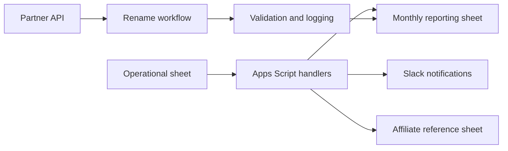

# my-scripts

Professional portfolio repository for automation, integration, and operational reliability work.

## Business problem
Operational partner workflows depended on repetitive spreadsheet edits, manual status tracking, and brittle handoffs between Google Sheets, Slack, and partner-platform APIs. The goal was to reduce manual effort, enforce consistent processing, and preserve auditability without exposing production credentials.

## Solution overview
This repository combines a Google Apps Script layer for spreadsheet-driven approvals and reporting with a Python package for safe partner-rename automation. The result is a portfolio-safe workflow that supports idempotent execution, structured logging, and repeatable validation for business-critical partner operations.

## Architecture
The repository is organized around two cooperating systems:
- Google Apps Script handles sheet events, Slack notifications, monthly alerts, and reporting syncs.
- Python service code performs API-driven rename execution, validation, and CSV-safe output generation.

See [docs/architecture.md](docs/architecture.md) for the detailed component view.

## Mermaid data-flow diagram

## Workflows
- Approval workflow for partner deals in the operational sheet.
- Monthly campaign alerting and reporting synchronization.
- Affiliate manager synchronization from the partner base.
- Partner search statistics and reset tracking.
- Rename automation with retry-safe verification.

## Reliability and idempotency
- Structured signatures and log caches reduce duplicate notifications and repeated writes.
- Rename operations preserve status history for retries without reprocessing successful steps.
- Spreadsheet sync logic uses normalized headers and lookup helpers to remain robust to formatting drift.

## Error handling
- Failures are logged with context rather than silently ignored.
- Retry-aware logic distinguishes transient and terminal conditions.
- Slack and spreadsheet integrations fail closed with descriptive errors where practical.

## Security
- Production secrets, spreadsheet identifiers, and internal data remain out of the repository.
- The repository uses synthetic examples and a secret-scanning workflow.
- Local OAuth files and virtual environments are kept out of source control.

## Modularization note
The Apps Script project remains centered on [google-apps-script/aff-partners-info/Code.gs](google-apps-script/aff-partners-info/Code.gs) for now. Full file-splitting was intentionally deferred to preserve the public trigger names and avoid breaking the existing spreadsheet integration during portfolio review.

## Repository structure
- [google-apps-script/aff-partners-info](google-apps-script/aff-partners-info) — Apps Script automation project.
- [rename_partners](rename_partners) — Python package for rename workflows and shared helpers.
- [docs/architecture.md](docs/architecture.md) — architecture notes.
- [.github/workflows/portfolio-ci.yml](.github/workflows/portfolio-ci.yml) — CI pipeline.

## Technology stack
- Google Apps Script
- JavaScript / Apps Script
- Python 3.11+
- pytest
- ruff
- openpyxl
- requests, pandas, gspread, google-auth

## Setup
1. Review the relevant project README in [google-apps-script/aff-partners-info/README.md](google-apps-script/aff-partners-info/README.md) and [rename_partners/README.md](rename_partners/README.md).
2. Install the Python package with `python -m pip install -e ./rename_partners[dev]`.
3. Configure local credentials and spreadsheet properties outside the repository.

## Configuration
- Apps Script properties such as `PF_SPREADSHEET_ID`, `SLACK_CHANNEL`, and webhook URLs should be supplied locally.
- Python settings are documented in [rename_partners/.env.example](rename_partners/.env.example).
- The sample workbook [google-apps-script/aff-partners-info/anonymized_table.xlsx](google-apps-script/aff-partners-info/anonymized_table.xlsx) is synthetic and safe for public display.

## Testing
- `pytest -q rename_partners/tests/test_portfolio_automation.py`
- `ruff check rename_partners/src rename_partners/tests`
- `python -m compileall rename_partners/src`
- Node-based smoke tests for Apps Script helper functions are included under [google-apps-script/aff-partners-info/tests](google-apps-script/aff-partners-info/tests).

## CI
Continuous integration runs the Python compile check, linting, tests, a lightweight Apps Script helper presence check, and a secret scan in [.github/workflows/portfolio-ci.yml](.github/workflows/portfolio-ci.yml).

## Known limitations
- The Apps Script project is intentionally documented as a portfolio-safe example rather than a production deployment.
- Some operational integrations depend on local spreadsheet properties and credentials that are not committed to the repository.

## Demonstrated engineering skills
- Automation design for complex spreadsheet workflows.
- Error handling and retry-safe orchestration.
- Safe handling of secrets, local artifacts, and public portfolio content.
- Test-driven validation and CI automation.
