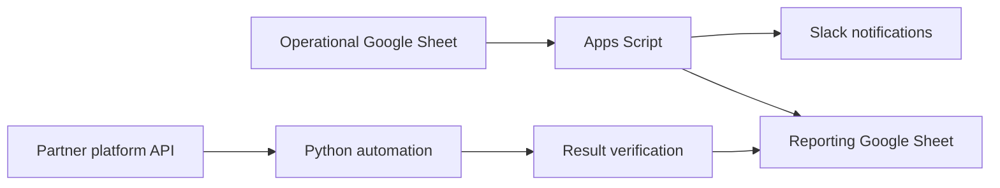

# Roman Petrov — Integration & Operations Specialist

**API integrations · Process automation · Google Sheets / Apps Script · Python · Slack · Data reconciliation**

I turn manual operational workflows into documented, repeatable automations. My focus is to understand business rules, connect systems and data, implement practical solutions, verify the result, and explain the process clearly to both technical and non-technical teams.

Based in Saint Petersburg and open to remote opportunities in:

- Integration Specialist / Integration Analyst;
- Implementation Engineer;
- Technical Analyst / Application Analyst;
- Affiliate TechOps / AdTech Integration;
- AI-assisted process automation.

[Русское описание проекта](README_RU.md) · [Architecture overview](docs/architecture.md) · [Telegram](https://t.me/Roman_Petrow) · [Email](mailto:petrov3rom@gmail.com)

---

## Featured portfolio case: Integration Automation

This repository contains an anonymized portfolio case based on a real operational workflow.

The original process used several Google Sheets, Slack notifications, and a partner platform API. Part of the work was performed manually, which could lead to repeated updates, missed status changes, and inconsistent data between spreadsheets.

The public version demonstrates how the workflow was converted into a more controlled automation with validation, status tracking, API operations, result verification, logging, and documentation.

### What was automated

- Slack notifications when operational statuses change;
- moving approved records between Google Sheets;
- synchronization of reporting and reference data;
- updating partner names through an HTTP API;
- checking the result after an API update;
- saving processing statuses for repeated runs;
- skipping completed operations and retrying failed ones;
- basic logging, validation, and error handling.

### What this case demonstrates

- analysis of an existing operational process and its business rules;
- translation of requests from non-technical teams into implementation logic;
- integration between Google Sheets, Slack, and an external API;
- synchronization between several data sources;
- handling of repeated runs and partial failures;
- result verification after external API operations;
- basic automated tests, code checks, and secret scanning;
- technical documentation and architecture description.

## Data flow

## Technologies

`Google Apps Script` · `JavaScript` · `Python` · `HTTP API` · `Google Sheets API` · `Slack API` · `pytest` · `Ruff` · `GitHub Actions`

## Project structure

- [`google-apps-script/aff-partners-info`](google-apps-script/aff-partners-info) — spreadsheet events, validation, notifications, data synchronization, and technical logs;
- [`google-apps-script/aff-partners-info/example-data`](google-apps-script/aff-partners-info/example-data) — instructions for preparing an anonymized workbook example;
- [`rename_partners`](rename_partners) — Python automation for API-based updates, result verification, retry logic, and spreadsheet synchronization;
- [`docs/architecture.md`](docs/architecture.md) — a short overview of the architecture and data flow;
- [`.github/workflows/checks.yml`](.github/workflows/checks.yml) — automated tests, linting, compilation checks, and secret scanning.

## Example workflow

1. A user changes a status or value in an operational spreadsheet.
2. Apps Script validates the edited row and required fields.
3. A Slack notification is sent when the configured conditions are met.
4. Approved data is copied to a reporting sheet.
5. A Python script reads partner IDs and target values from Google Sheets.
6. The script performs an API update and reads the value again to verify the result.
7. Processing status is recorded so completed operations are skipped and failed operations can be retried.

## How I approach automation tasks

1. Understand the original process, users, data sources, and business rules.
2. Identify repetitive actions, failure points, and reconciliation gaps.
3. Convert the request into clear implementation and validation logic.
4. Build a practical prototype with the simplest suitable tools.
5. Test normal, empty, duplicate, failed, and repeated-run scenarios.
6. Document the workflow and present the result in clear language.

## Security and public version

This repository does not contain production credentials, real spreadsheet identifiers, internal Slack IDs, company names, partner data, or commercial information.

Configuration values are expected to remain local in Script Properties, `.env` files, OAuth files, or other non-public settings. GitHub Actions also runs a basic secret scan against committed text files.

Some integrations cannot be executed without access to the original Google Sheets, Slack workspace, and partner platform. The repository therefore demonstrates the code, architecture, validation logic, and engineering approach rather than providing a standalone deployable product.

## Current focus

I am expanding this portfolio toward n8n, AI-assisted workflow automation, integration analysis, SQL, API testing, and reusable operational tools.

## Contact

- Telegram: [@Roman_Petrow](https://t.me/Roman_Petrow)
- Email: [petrov3rom@gmail.com](mailto:petrov3rom@gmail.com)
- Russian project description: [README_RU.md](README_RU.md)
