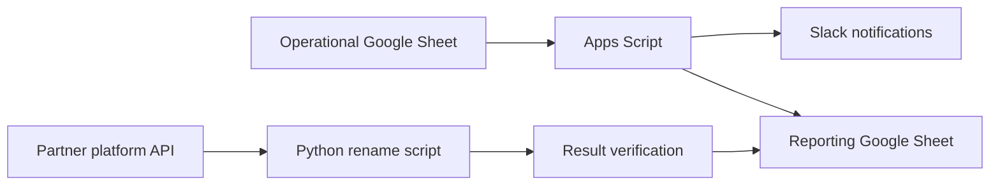

# Integration Automation Case

This repository contains anonymized examples of automation created for operational partner workflows.

The original process used several Google Sheets, Slack notifications, and a partner platform API. Some actions were performed manually, which could lead to repeated updates, missed status changes, and inconsistent data between spreadsheets.

## What was automated

- Slack notifications when operational statuses change;
- moving approved records between Google Sheets;
- synchronization of reporting data;
- updating partner names through an API;
- checking the result after an API update;
- saving processing statuses for repeated runs;
- basic logging and error handling.

## Project structure

- [`google-apps-script/aff-partners-info`](google-apps-script/aff-partners-info) — spreadsheet events, notifications, and data synchronization;
- [`google-apps-script/aff-partners-info/example-data`](google-apps-script/aff-partners-info/example-data) — instructions for adding a manually anonymized workbook example;
- [`rename_partners`](rename_partners) — API-based partner name updates and follow-up spreadsheet synchronization;
- [`docs/architecture.md`](docs/architecture.md) — a short overview of the data flow;
- [`.github/workflows/checks.yml`](.github/workflows/checks.yml) — automated code checks.

## Data flow

## Technologies

- Google Apps Script and JavaScript;
- Python;
- Google Sheets API;
- Slack webhooks and bot API;
- HTTP API;
- pytest, Ruff, and GitHub Actions.

## Example workflow

1. A user changes a status in an operational spreadsheet.
2. Apps Script validates the edited row.
3. A Slack notification is sent when required.
4. Approved data is copied to a reporting sheet.
5. A Python script can update a partner name through the API.
6. The script reads the value again and records the result.
7. On the next run, completed partner IDs are skipped while failed operations can be retried.

## Public version

This repository does not contain production credentials, real spreadsheet identifiers, internal Slack IDs, or company data.

Any workbook example added to the repository should be prepared manually from a copy of the original structure and fully anonymized before publication.

Some integrations cannot be executed without access to the original Google Sheets and partner platform.

## What this project demonstrates

- analysis of an existing operational process;
- automation of repetitive spreadsheet work;
- interaction with an HTTP API;
- synchronization between several data sources;
- handling of repeated runs and partial failures;
- basic testing and documentation of automation scripts.

## Current limitations

- the Apps Script part is still stored mainly in one large `Code.gs` file;
- most tests cover helper functions rather than the complete Google Sheets workflow;
- external integrations require local configuration and access credentials;
- the project was created for a specific operational process and is not a universal framework.
