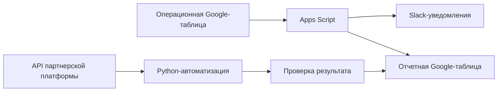

# Роман Петров — специалист по интеграциям и автоматизации процессов

**API-интеграции · Google Sheets / Apps Script · Python · Slack · сверка и синхронизация данных**

Разбираю ручные операционные процессы и превращаю их в более управляемые и повторяемые решения. Мой фокус — понять бизнес-логику, связать данные и системы, реализовать практичную автоматизацию, проверить результат и объяснить готовый процесс техническим и нетехническим командам.

Рассматриваю удаленные роли:

- специалист по интеграциям / Integration Specialist;
- Integration Analyst / системный аналитик с техническим уклоном;
- специалист по внедрению / Implementation Engineer;
- Technical Analyst / Application Analyst;
- Affiliate TechOps / AdTech Integration;
- специалист по автоматизации IT/AI-процессов.

[English README](README.md) · [Архитектура](docs/architecture.md) · [Telegram](https://t.me/Roman_Petrow) · [Email](mailto:petrov3rom@gmail.com)

---

## Основной портфолио-кейс: автоматизация интеграционных и операционных процессов

Репозиторий содержит обезличенный кейс, подготовленный на основе реальной операционной логики.

Исходный процесс использовал несколько Google Sheets, Slack-уведомления и API партнерской платформы. Часть действий выполнялась вручную, из-за чего могли возникать повторные обновления, пропущенные изменения статусов и расхождения между таблицами.

Публичная версия показывает, как такой процесс можно сделать более контролируемым: добавить проверки, обработку статусов, API-операции, повторную проверку результата, логи, retry-логику и документацию.

## Что автоматизируется

- обработка изменений статусов в операционной Google-таблице;
- отправка Slack-уведомлений при выполнении заданных условий;
- перенос подтвержденных записей между Google Sheets;
- синхронизация справочных и отчетных данных;
- обновление названий партнеров через HTTP API;
- повторная проверка результата после API-обновления;
- сохранение статусов обработки для повторных запусков;
- пропуск уже выполненных операций и повторная обработка ошибок;
- базовое логирование, валидация и обработка частичных сбоев.

## Что демонстрирует кейс

- анализ существующего операционного процесса и его бизнес-правил;
- перевод запросов нетехнических подразделений в понятную логику реализации;
- интеграцию между Google Sheets, Slack и внешним API;
- синхронизацию данных между несколькими источниками;
- обработку повторных запусков и частичных ошибок;
- проверку результата после внешней API-операции;
- базовые автоматические тесты, проверки кода и поиск возможных секретов;
- подготовку технической документации и схемы архитектуры.

## Поток данных

## Стек

`Google Apps Script` · `JavaScript` · `Python` · `HTTP API` · `Google Sheets API` · `Slack API` · `pytest` · `Ruff` · `GitHub Actions`

## Структура проекта

- [`google-apps-script/aff-partners-info`](google-apps-script/aff-partners-info) — события в таблицах, проверки, уведомления, синхронизация данных и технические логи;
- [`google-apps-script/aff-partners-info/example-data`](google-apps-script/aff-partners-info/example-data) — инструкция по подготовке обезличенного примера рабочей книги;
- [`rename_partners`](rename_partners) — Python-автоматизация API-обновлений, проверки результата, повторных попыток и синхронизации с Google Sheets;
- [`docs/architecture.md`](docs/architecture.md) — краткое описание архитектуры и потока данных;
- [`.github/workflows/checks.yml`](.github/workflows/checks.yml) — автоматические тесты, линтинг, проверка компиляции и поиск возможных секретов.

## Общая логика процесса

1. Пользователь меняет статус или значение в операционной Google-таблице.
2. Apps Script проверяет измененную строку, обязательные поля и условия обработки.
3. При необходимости отправляется Slack-уведомление.
4. Подтвержденные данные переносятся в отчетную таблицу.
5. Python-скрипт получает партнерские ID и целевые значения из Google Sheets.
6. Скрипт выполняет API-обновление и повторно читает значение для проверки результата.
7. Статус обработки сохраняется, поэтому успешные операции не выполняются повторно, а ошибки можно обработать еще раз.

## Как я подхожу к задачам автоматизации

1. Разбираю исходный процесс, роли пользователей, источники данных и бизнес-правила.
2. Выделяю повторяемые действия, точки ошибок и причины расхождений.
3. Перевожу запрос заказчика в понятную логику реализации и проверок.
4. Собираю практичный прототип на минимально достаточном стеке.
5. Проверяю обычные сценарии, пустые значения, дубли, ошибки и повторные запуски.
6. Документирую процесс и презентую результат понятным языком.

## Безопасность и публичная версия

Публичная версия репозитория не содержит:

- production credentials;
- реальных токенов и API-ключей;
- реальных spreadsheet ID;
- внутренних Slack ID;
- названий компаний;
- коммерческих данных;
- реальных данных партнеров или пользователей.

Конфигурационные значения должны храниться локально: через Script Properties в Google Apps Script, `.env`-файлы, OAuth-файлы и другие настройки, которые не публикуются в репозитории. В GitHub Actions также запускается базовая проверка текстовых файлов на возможные секреты.

Часть интеграций нельзя запустить без доступа к исходным Google Sheets, Slack workspace и партнерской платформе. Поэтому репозиторий демонстрирует код, архитектуру, проверки и подход к реализации, а не является готовым универсальным продуктом.

## Текущий фокус развития

Расширяю портфолио в сторону n8n, AI-assisted automation, интеграционного анализа, SQL, тестирования API и создания переиспользуемых инструментов для операционных процессов.

## Контакты

- Telegram: [@Roman_Petrow](https://t.me/Roman_Petrow)
- Email: [petrov3rom@gmail.com](mailto:petrov3rom@gmail.com)
- Основное описание проекта: [README.md](README.md)
