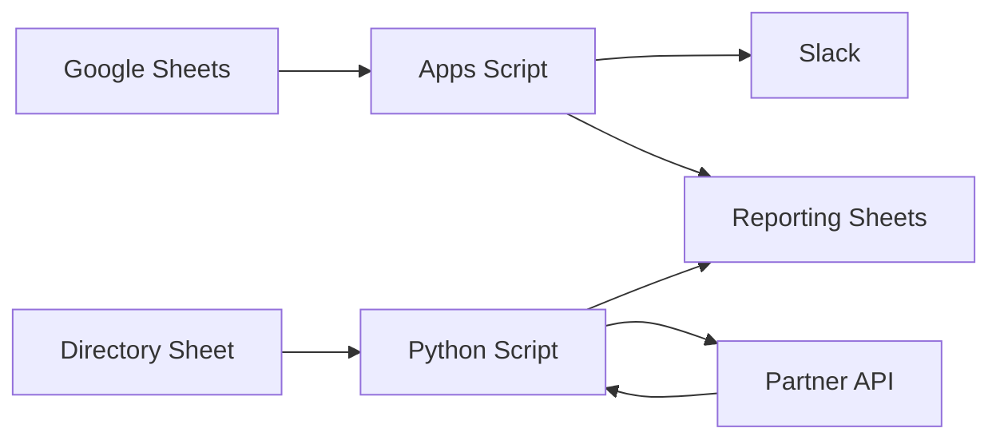

# Architecture Overview

The repository contains two related automation parts.

## Google Apps Script

The Apps Script project reacts to changes in Google Sheets and performs spreadsheet-oriented operations:

- reads edited rows;
- checks statuses and required fields;
- sends Slack notifications;
- copies approved records;
- synchronizes reporting data;
- stores technical logs in separate sheets.

## Python scripts

The Python scripts are used for operations that are more convenient to run outside Google Sheets:

- reading partner IDs from a directory sheet;
- updating names through the partner platform API;
- reading the value again to verify the update;
- recording the processing result;
- synchronizing confirmed names with another spreadsheet.

## Data flow

## Project boundaries

The public repository contains anonymized code and configuration examples.

A workbook example, when included, should be a manually prepared copy with real values, comments, links, identifiers, and document metadata removed.

The repository does not include production credentials, real spreadsheet identifiers, internal Slack IDs, production datasets, or access to the external partner platform.

The repository demonstrates the automation logic. It is not intended to be deployed as a standalone product without adaptation.
