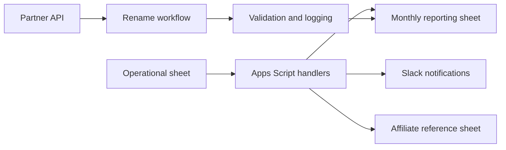

# Architecture Notes

## Overview
This repository combines a Google Apps Script automation layer with a Python package for safe partner-rename orchestration.

## Components
- Google Apps Script project in google-apps-script/aff-partners-info for spreadsheet-driven approvals, monthly alerts, and reporting syncs.
- Python package in rename_partners for API-driven partner rename operations and spreadsheet synchronization.
- CI workflow in .github/workflows/portfolio-ci.yml for linting, tests, compile checks, and secret scanning.

## Data flow

## Reliability and idempotency
- Spreadsheet actions are guarded by header normalization and duplicate detection helpers.
- Rename operations reuse structured status marks to avoid reprocessing completed work.
- Logging and signature checks prevent duplicate alerts and repeated writes where possible.

## Security
- Example credentials and production identifiers remain out of the repository.
- The workflow uses a secret-scanning step and the workbook artifact is synthetic.

## Modularization note
The Apps Script entry point remains [google-apps-script/aff-partners-info/Code.gs](../google-apps-script/aff-partners-info/Code.gs) for compatibility with the existing trigger names. The helper functions added for tests are still reachable from the same public entry points, and a broader split into multiple .gs files was deferred to avoid breaking the live spreadsheet workflow during review.
